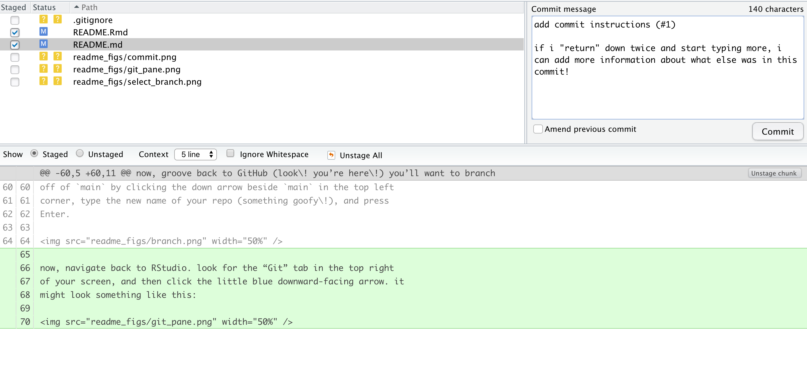

```{r, echo = FALSE, message = FALSE, warning = FALSE}
library(knitr)
```

yall! !!!

this is a GitHub repository that will help us manage an update to the [Data at Reed](data-at-reed) site. specifically, the information at [Analyzing & Visualizing Data > R tutorials]!

ideally, we can point people who come into the mLab to that site to help address common issues. unfortunately, Nothing Has Happened to those pages for a good bit of time and, as a result, they don’t reflect the kinds of issues we see most often now.

so uhhh they need updating! sweet.

all of the files that the site actually runs off of (is that how you say that? idk web stuff) are held in something called a Content Management System, which is kinda scary. Leila and I are able to pull the files out of there and put them back in, but we'd rather not, like, _work in there_.

okay, so that's where Git comes in. it's my sense that everyone has done a little git, maybe not a ton of Git. various levels of Comfy are fine.

## git: tl;dr

this is a _repository_--it's kind of like a folder on Google Drive. however many people we want can have access to it, except...

changes to any documents happen in really discrete steps called _commits_. commits can be as long (i'll draft this README in one) or as short (i.e. fix a typo, see later) as you want.

right now, you're probably looking at the `main` _branch_. branches allow you to "branch off" (~make a copy of) a repository, make changes by adding as many commits as you want, and then _pull requesting_ back in (something along the lines of "can i plz merge my changes into the real thing??") to the `main` branch.

doing each of those things for the first time can be scary, and i'll try to make the first go at doing each as cozy as possible. if you'd appreciate more than, say, a sentence of explanation on each of this, i highly recommend Jenny Bryan's book [_Happy Git With R_](https://happygitwithr.com/).

## workflow

#### getting set up

okokok let's get to it!

you'll first want to close this repo to an rstudio project. [HGwR Chapter 15.2](https://happygitwithr.com/new-github-first.html#new-rstudio-project-via-git-clone) might be helpful if you haven't done this before.

alright, you have a project in RStudio now. sweet.

now, groove back to GitHub (look! you're here!) you'll want to branch off of `main` by clicking the down arrow beside `main` in the top left corner, type the new name of your repo (something goofy!), and press Enter.

```{r branch, echo = FALSE, out.width = '50%'}
knitr::include_graphics("readme_figs/branch.png")
```

now, navigate back to RStudio. look for the "Git" tab in the top right of your screen, and then click the "Pull" (little blue downward-facing arrow) button. it might look something like this:

```{r git-pane, echo = FALSE, out.width = '50%'}
knitr::include_graphics("readme_figs/git_pane.png")
```

as of now, you're probably still on the `main` branch. see where it says `main` in the top right corner of that screenshot? click the down arrow directly to it's right and select your new branch:

```{r select-branch, echo = FALSE, out.width = '50%'}
knitr::include_graphics("readme_figs/select_branch.png")
```

woop woop woop! almost there!

now, while reading through this document, you might have noticed a typo. (i'm not saying i intentionally placed any--i just make a lot of typos!) there might have also been a step that needed additional clarification for you.

find some spot in this README to make a small edit, make the edit in `README.Rmd`, and then knit to `README.md`. nice.

now, navigate back to the Git pane, check the boxes beside `README.Rmd` and `README.md` (they should be blue now), and press "commit".

```{r commit, echo = FALSE, out.width = '50%'}
knitr::include_graphics("readme_figs/commit.png")
```

you should be brought to a new window that looks something like this:

```{r commit2, echo = FALSE, out.width = '100%'}

```

in the top right box, you can see that i've written a _commit message_. this will let the rest of us know what you're doing in a commit, and also helps to bring our collaboration workflow much closer to the documents we're actually working on.

i dropped the text `#1` into that commit message. GitHub is smart enough to know that, when i do that, i'm linking to an issue or pull request. (an aside: if i had written `closes #1`, then, when i push that commit, the issue will be automatically closed! slick!)

eventually, we'll have issues open about specific documents (or sections of documents) we're working on. it'll be helpful to know what changes are relevant to what sections of what documents.

okay whatever whatever whatever so write your message to note what you changed, and make sure to link to issue 1 by writing `(#1)` somewhere in your commit message.

now go ahead and press the "Commit" button below your message and then press the "Push" button (the green up arrow.) if you go back to GitHub and navigate to your new branch, you should see your newest commit!

okay okay okay last step! all we need to do now is try to merge our changes back in to the `main` branch.

while i'm writing this, i just branched off to a branch called `pull-requesting`. i want to merge the changes i'm making now back into `main`. i'm going to go ahead and commit and then make a pull request to `main`!


